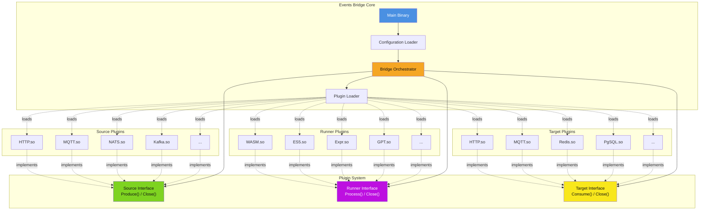

# Events Bridge

A flexible, plugin-based event streaming platform for integrating and transforming messages across different protocols and data sources.

## Overview

Events Bridge enables you to:

- **Consume** events from a source (HTTP, MQTT, NATS, Kafka, Redis, PostgreSQL, CoAP, Git, etc.)
- **Transform** messages through one or more runners (WASM, ES5, Expr, JSONLogic, GPT)
- **Publish** events to a target using the same variety of protocols

All through a simple YAML configuration file.

## Quick Start

```sh
# 1. Build the project
go build -o bin/events-bridge ./src

# 2. Create a simple configuration
cat > config.yaml << EOF
source:
  type: "http"
  buffer: 100
  options:
    port: 8080
    path: "/webhook"

target:
  type: "http"
  routines: 5
  options:
    url: "http://localhost:9090/receive"
    method: "POST"
EOF

# 3. Run the bridge
export EB_CONFIG_FILE_PATH=config.yaml
./bin/events-bridge

# 4. Send a test message
curl -X POST http://localhost:8080/webhook \
  -H "Content-Type: application/json" \
  -d '{"message": "Hello Events Bridge!"}'
```

## Architecture

The application follows a **Source → Runner(s) → Target** pipeline:

```mermaid
flowchart LR
    Start([Start]) --> LoadConfig[Load YAML Configuration]
    LoadConfig --> InitSource[Initialize Source Plugin]
    InitSource --> InitRunners{Runners<br/>Configured?}
    
    InitRunners -->|Yes| LoadRunners[Load Runner Plugins]
    InitRunners -->|No| InitTarget
    
    LoadRunners --> InitTarget[Initialize Target Plugin]
    
    InitTarget --> ProduceMsg[Source Produces Messages]
    ProduceMsg --> MsgBuffer[(Message Buffer)]
    
    MsgBuffer --> CheckRunners{Has<br/>Runners?}
    
    CheckRunners -->|No| CheckTarget{Has<br/>Target?}
    CheckRunners -->|Yes| EvalIf{Evaluate<br/>If Condition}
    
    EvalIf -->|False| NextRunner
    EvalIf -->|True| ProcessRunner[Process with Runner]
    
    ProcessRunner --> EvalFilter{Evaluate<br/>Filter}
    EvalFilter -->|Filtered Out| Ack1[Ack Message]
    EvalFilter -->|Pass| NextRunner{More<br/>Runners?}
    
    NextRunner -->|Yes| EvalIf
    NextRunner -->|No| CheckTarget
    
    CheckTarget -->|Yes| ConsumeTarget[Target Consumes Message]
    CheckTarget -->|No| ReplySource[Reply to Source]
    
    ConsumeTarget --> Ack2[Ack Message]
    ReplySource --> Done
    Ack1 --> Done
    Ack2 --> Done
    
    Done{More<br/>Messages?}
    Done -->|Yes| MsgBuffer
    Done -->|No| Shutdown[Graceful Shutdown]
    Shutdown --> CloseAll[Close All Connectors]
    CloseAll --> End([End])
    
  style Start fill:#90EE90,color:#111
  style End fill:#FFB6C1,color:#111
  style MsgBuffer fill:#87CEEB,color:#111
  style ProcessRunner fill:#FFD700,color:#111
  style ConsumeTarget fill:#FFA500,color:#111
  style ReplySource fill:#DDA0DD,color:#111
```



- **Source**: Produces messages from a data source (connector plugins)
- **Runner** (optional): Transforms, filters, or enriches messages (can chain multiple runners)
- **Target**: Consumes and publishes messages to a destination (connector plugins)

### Plugin-Based Architecture

Events Bridge uses a **dynamic plugin system** for connectors:

- **Connectors are compiled as Go plugins** (`.so` files) and loaded at runtime
- Each connector implements one or more interfaces: `Source`, `Runner`, or `Target`
- Plugins are discovered automatically from the `bin/connectors/` directory
- Configuration is passed to plugins via the `options` map in YAML
- This architecture allows:
  - **Easy extensibility**: Add new protocols without recompiling the main binary
  - **Hot-swappable connectors**: Update plugins independently
  - **Clean separation**: Each protocol/service lives in its own module



**Plugin Interfaces:**

```go
// Source produces messages
type Source interface {
    Produce(buffer int) (<-chan *message.RunnerMessage, error)
    Close() error
}

// Runner transforms messages
type Runner interface {
    Process(*message.RunnerMessage) error
    Close() error
}

// Target consumes messages
type Target interface {
    Consume(*message.RunnerMessage) error
    Close() error
}
```

Each plugin exports factory functions (`NewSource`, `NewRunner`, `NewTarget`) that accept configuration and return the appropriate interface implementation.

## Supported Connectors

### Sources & Targets

- **HTTP/HTTPS**: REST APIs and webhooks
- **MQTT**: IoT messaging protocol
- **NATS**: Cloud-native messaging system
- **Kafka**: Distributed event streaming
- **Redis**: Streams and Pub/Sub
- **PostgreSQL**: Database polling and LISTEN/NOTIFY
- **CoAP**: Constrained Application Protocol
- **Google Pub/Sub**: Cloud messaging
- **Git**: Repository monitoring
- **CLI**: Command-line input/output

### Runners

- **WASM**: WebAssembly modules for custom logic
- **ES5**: JavaScript transformation (Goja engine)
- **Expr**: Expression language for filtering and transformations
- **JSONLogic**: JSON-based logic rules
- **GPT**: OpenAI integration for AI-powered processing
- **Plugin**: Custom Go plugins

## Configuration

Events Bridge uses a simple YAML configuration that defines the pipeline:

### Basic Configuration Structure

```yaml
source:
  type: "http"           # Source connector type
  buffer: 100            # Message buffer size
  options:               # Source-specific options
    port: 8080
    path: "/webhook"

runners:                 # Optional transformation pipeline
  - type: "expr"         # First runner
    routines: 10         # Concurrent processing goroutines
    ifExpr: "data.value > 0"      # Optional: condition to run this runner
    filterExpr: "data.valid == true"  # Optional: filter messages
    options:
      expr: "data.value * 2"
  
  - type: "wasm"         # Second runner (chained)
    routines: 5
    options:
      wasmFile: "./transform.wasm"

target:
  type: "mqtt"           # Target connector type
  routines: 5            # Concurrent consumption goroutines
  options:               # Target-specific options
    broker: "tcp://localhost:1883"
    topic: "events/processed"
    qos: 1
```

### Configuration via Environment Variables

**Option 1**: Specify config file path

```sh
export EB_CONFIG_FILE_PATH=/path/to/config.yaml
./events-bridge
```

**Option 2**: Provide configuration content directly

```sh
export EB_CONFIG_CONTENT="$(cat config.yaml)"
export EB_CONFIG_FORMAT=yaml  # or json
./events-bridge
```

### Configuration Examples

Find complete configuration examples in the [`testers/config/`](testers/config/) directory:

- `http-wasm-http.yaml` - HTTP to HTTP with WASM transformation
- `nats-jlo-nats.yaml` - NATS to NATS with JSONLogic processing
- `kafka-jlo-kafka.yaml` - Kafka to Kafka with message filtering
- `mqtt-wasm-http.yaml` - MQTT to HTTP with WASM runner
- And many more...

## Installation

### Build from source

```sh
go build -o events-bridge ./src
```

### Build with Task (recommended)

```sh
task build
```

This creates the main binary and all connector plugins in `bin/`.

## Usage

### Running the Bridge

With a configuration file:

```sh
export EB_CONFIG_FILE_PATH=/path/to/config.yaml
./bin/events-bridge
```

Or run directly with Go:

```sh
export EB_CONFIG_FILE_PATH=/path/to/config.yaml
go run ./src/main.go
```

### Example: HTTP to MQTT with Transformation

```yaml
# config.yaml
source:
  type: "http"
  buffer: 100
  options:
    port: 8080
    path: "/api/events"

runners:
  - type: "expr"
    routines: 10
    options:
      expr: |
        {
          "temperature": data.temp * 1.8 + 32,
          "sensor_id": data.id,
          "timestamp": now()
        }

target:
  type: "mqtt"
  routines: 5
  options:
    broker: "tcp://localhost:1883"
    topic: "sensors/temperature"
    qos: 1
```

### Graceful Shutdown

The bridge handles `SIGINT` and `SIGTERM` signals for graceful shutdown:

```sh
# Send SIGTERM
kill -TERM <pid>

# Or use Ctrl+C for SIGINT
```

All connectors are closed properly with retry logic to ensure clean resource cleanup.

## Security Features

Events Bridge includes multiple layers of security:

- **TLS/mTLS Support**: Encrypted connections for network protocols (HTTP, MQTT, NATS, Redis, PostgreSQL)
- **Authentication**: Token-based, certificate-based, and credential-based authentication
- **Input Validation**: Comprehensive sanitization and validation across all connectors
- **Secret Management**: Support for environment variables and external secret managers
- **Sandboxing**: Isolated execution environments for WASM and plugin-based code execution
- **Rate Limiting**: Protection against resource exhaustion and DoS attacks
- **Audit Logging**: Detailed logging of all operations for compliance and debugging

For detailed security information, see [`context/SECURITY-SUMMARY.md`](context/SECURITY-SUMMARY.md).

## Development

### Requirements

- Go 1.25+
- Docker (for integration tests)
- Task (optional, for build automation)
- golangci-lint (for linting)

### Available Tasks

```sh
task                    # Run all checks (fmt, lint, vet, test)
task build              # Build binaries and plugins
task test               # Run all tests
task test-coverage      # Generate coverage report
task security-scan      # Run security analysis
task lint               # Run golangci-lint
```

### Development Workflow

1. Make changes to code
2. Run tests: `go test ./...` or `task test`
3. Ensure 80%+ coverage: `task test-coverage`
4. Run linter: `golangci-lint run ./src/...`
5. Update inline documentation
6. Update `context/changes.md` with changes
7. Commit using conventional commits format

### Project Structure

```text
src/
  ├── main.go           # Application entry point
  ├── config/           # Configuration loading and validation
  ├── connectors/       # Plugin system and connector interfaces
  ├── message/          # Message types and utilities
  ├── common/           # Shared utilities (encoding, expressions, etc.)
  └── utils/            # Plugin loader and helpers

testers/                # Integration testing tools
localtest/              # Docker compose environments
```

## Testing

### Unit Tests

Run all unit tests:

```sh
go test ./...
```

Run tests with coverage:

```sh
go test -cover ./...
```

Generate HTML coverage report:

```sh
task test-coverage
# Opens coverage.html in browser
```

### Integration Tests

Integration tests use **Testcontainers** to spin up real dependencies (Kafka, Redis, PostgreSQL, NATS, MQTT, etc.) in Docker containers.

```sh
# Ensure Docker is running
docker ps

# Run integration tests
go test ./src/connectors/... -tags=integration
```

### Benchmark Tests

Benchmark tests are in separate `*_bench_test.go` files:

```sh
# Run all benchmarks
go test -bench=. ./...

# Run specific benchmark
go test -bench=BenchmarkMessageProcessing ./src/bridge
```

### Test Organization

```text
src/
├── bridge/
│   ├── bridge_test.go          # Unit tests
│   └── bridge_bench_test.go    # Benchmarks
├── connectors/
│   ├── http/
│   │   ├── http_test.go        # Unit tests
│   │   └── http_integration_test.go  # Integration tests
│   └── ...
└── testutil/                    # Shared test utilities
    ├── stub.go                  # Test stubs
    └── adapter.go               # Test adapters
```

## License

See the [LICENSE](LICENSE) file for details.
